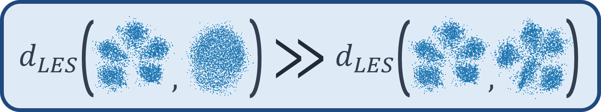

# Log-Euclidean Signatures for Intrinsic Distances Between Unaligned Datasets

Python implementation of the LES distance and examples from the [paper](https://arxiv.org/abs/2202.01671). LES is a
geometric, data-driven intrinsic measure for comparing unaligned datasets of different dimensions and domains.

## Prerequisites

* [Numpy](https://numpy.org/install/)
* [SciPy](https://scipy.org/install/)
* [Matplotlib](https://matplotlib.org/stable/users/installing/index.html)
* Optional packages for clustered data usage example: [scikit-learn](https://scikit-learn.org/stable/install.html)
* Optional packages and repositories for comparisons with other algorithms:
    - [IMD](https://github.com/xgfs/imd) [1] - clone and place the `msid` folder in the current folder.
    - TDA: H0, H1 and H2 bottleneck distances, requires [persim](https://pypi.org/project/persim/)
      , [ripser](https://pypi.org/project/ripser/).
    - [GS](https://github.com/KhrulkovV/geometry-score) [2] - clone and place the `gs` folder in the current folder.\
      Requires [GUDHI](https://gudhi.inria.fr/python/latest/installation.html)
      and [Cython](https://pypi.org/project/Cython/).
    - GW [3] - requires [pot](https://pythonot.github.io/auto_examples/plot_Intro_OT.html).

The code was tested with python 3.8 and 3.9

## Usage example of LES

### Distances between multi-cluster and single-cluster datasets of different dimensions

.. code-block:: python

    import numpy as np
    import sklearn.datasets as skld
	from les.les import les_desc_comp, les_dist_comp
    
    np.random.seed(1)
    x1 = skld.make_blobs(n_samples=1000, centers=5, n_features=10)[0]
    x2 = skld.make_blobs(n_samples=1000, centers=5, n_features=9)[0]
    x3 = skld.make_blobs(n_samples=1000, centers=1, n_features=10)[0]
    
    SIGMA, NEV, GAMMA = 2, 200, 1e-8     
    les_desc_x1 = les_desc_comp(x1, SIGMA, NEV, GAMMA)
    les_desc_x2 = les_desc_comp(x2, SIGMA, NEV, GAMMA)
    les_desc_x3 = les_desc_comp(x3, SIGMA, NEV, GAMMA)
    
    print('LES(x1{5 clusters}, x2{5 clusters})=',les_dist_comp(les_desc_x1, les_desc_x2))
    print('LES(x1{5 clusters}, x3{1 cluster})=',les_dist_comp(les_desc_x1, les_desc_x3))
    print('LES(x2{5 clusters}, x3{1 cluster})=',les_dist_comp(les_desc_x2, les_desc_x3))

### Running the tori example (Figure 1 in the paper)

.. code-block:: python

	main_tori.py

By default the code compares LES only with our implementation of IMD (our approach) to reduce run-time and code
dependencies. To compare with additional algorithms that were mentioned in the paper, specify the algorithm names in `main_tori.py`, `ALGS2COMPARE`, and follow
the installation instructions of each package in the prequisites above.
Note that the topological data analysis methods (tda) and Gromov-Wasserstein distance (gw) require significantly longer
run-times.

## References

[1] Tsitsulin et al., "The Shape of Data: Intrinsic Distance for Data Distributions", ICLR, 2019.\
[2] Khrulkov and Oseledets, "Geometry score: A method for comparing generative adversarial networks", ICML, 2018.\
[3] Peyré et al., "Gromov-Wasserstein averaging of kernel and distance matrices", ICML, 2016.